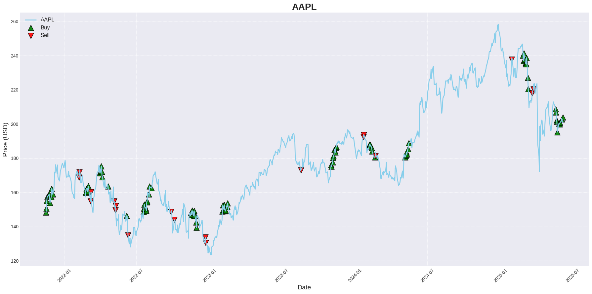
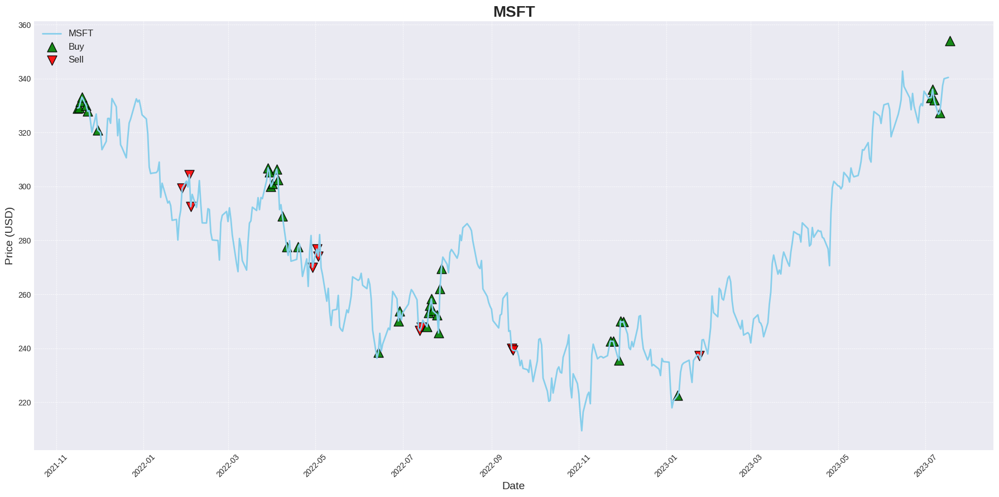
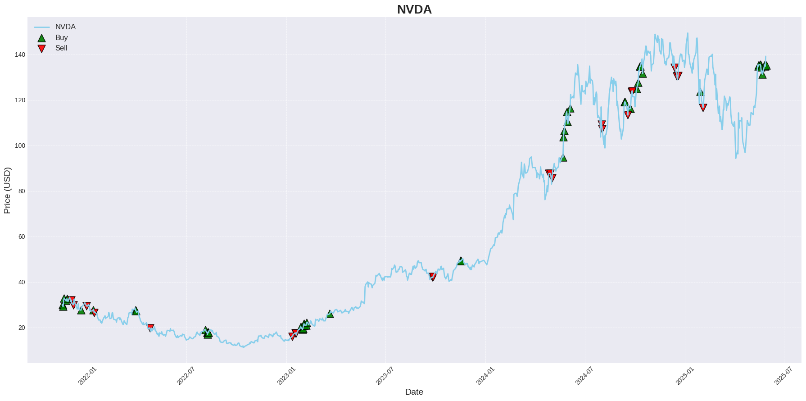
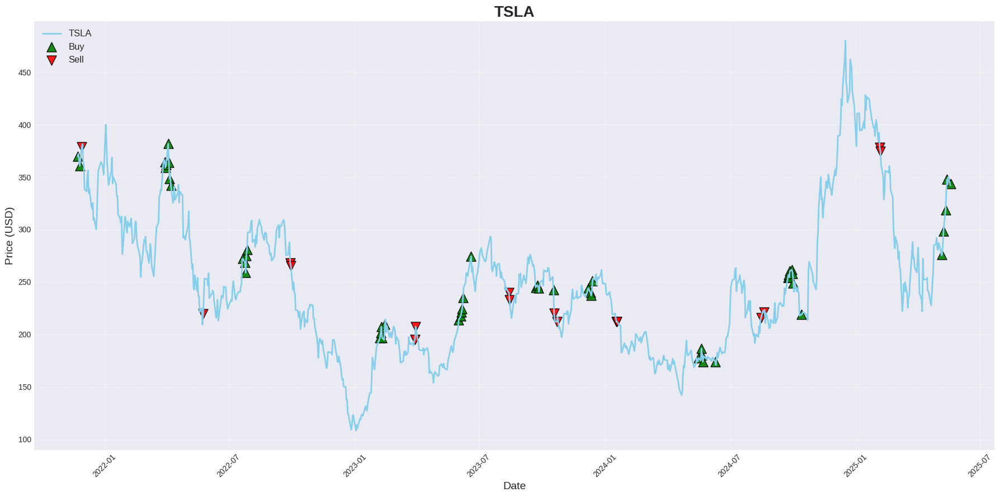

# FinMem-LLM: 자기반성 및 법률 자문이 가능한 AI 주식 트레이딩 에이전트

본 프로젝트는 대규모 언어 모델(LLM)을 활용하여 실제 금융 전문가처럼 사고하고, 자신의 투자 실수를 통해 학습하며, **외부 법률 지식까지 참고하여** 의사결정을 내리는 지능형 주식 트레이딩 에이전트를 구축합니다.

이 프로젝트는 기존 FinMem의 아이디어를 바탕으로, 다음과 같은 핵심적인 개선점을 도입하여 완전히 새로운 차원의 의사결정 시스템을 구현했습니다.

---

## 🚀 핵심 개선점 (Key Features)

기존 FinMem 모델이 감성 분석에 의존했다면, 저희는 LLM의 추론 능력을 극대화하는 새로운 아키텍처를 설계했습니다.

### 1. 멀티-페르소나 투자 위원회 (Multi-Persona Investment Committee)
단일 관점의 분석을 탈피하여, 각기 다른 투자 철학을 가진 3개의 AI 페르소나가 독립적인 분석을 수행합니다.

-   **가치 투자자 (Value Investor)**: 재무 건전성, 밸류에이션, 장기적 리스크를 분석합니다.
-   **성장 투자자 (Growth Investor)**: 기술 혁신, 시장 확장성(TAM), 성장 촉매제를 분석합니다.
-   **기술적 분석가 (Technical Trader)**: 시장 심리, 차트 패턴, 모멘텀을 분석합니다.

최종적으로 **CIO(최고 투자 책임자)** 페르소나가 이들의 상충되는 의견을 종합하여, 가장 합리적인 투자 결정을 내립니다.

### 2. 자기반성 학습 루프 (Self-Correction Loop)
에이전트는 단순히 거래만 하는 것이 아니라, 자신의 과거를 복기하며 학습합니다. 이 기능은 원본 FinMem의 `reflection` 모듈을 대폭 개선하여 구현되었습니다.

- **오답 노트 (Failure Memory)**: 거래에서 손실이 발생하면, "왜 실패했는가?"를 스스로 분석하여 그 원인을 '실패 기억'에 기록합니다.

- **동적 페르소나 전환**: 다음 분석 시, "오답 노트"와 현재 시장 상황(상승장/하락장)을 최우선으로 고려하여, 자신의 기본 성격(System Prompt)을 동적으로 변경합니다. 예를 들어, 하락장에서는 극도로 보수적인 리스크 관리자로 변신하여 섣부른 매수를 자제합니다.

### 3. RAG 기반 법률 자문 시스템 (RAG-based Legal Advisory)
LLM이 가진 환각(Hallucination)의 한계를 극복하고, 실제 법률 및 규제 데이터에 기반한 의사결정을 내립니다.

- **벡터 DB 기반 지식 창고**: **법제처 국가법령정보센터**에서 제공하는 **'금융소비자 보호에 관한 법률'** 및 관련 하위 규정 데이터를 원본으로 사용하여 벡터 데이터베이스를 구축합니다.
- **사실 기반 추론**: 투자 결정 과정에서 에이전트가 이 벡터 DB에 관련 내용을 직접 질의하고, 검색된 사실을 바탕으로 법적 리스크나 규제 준수 여부를 판단합니다. 이를 통해 훨씬 더 안전하고 현실적인 트레이딩을 수행합니다.

---
## 💡 적용된 프롬프트 엔지니어링 (Prompt Engineering Techniques Applied)

본 에이전트의 뛰어난 의사결정 능력은 다음과 같은 여러 프롬프트 엔지니어링 기법들의 유기적인 결합을 통해 구현됩니다.

#### 🎭 페르소나 패턴 (Persona Pattern)
각 LLM 에이전트에게 '가치 투자자', '성장 투자자' 등 명확한 역할과 투자 철학을 부여하여, 다각적이고 깊이 있는 분석을 유도합니다.

#### 📝 자기반성 (Self-Reflection)
과거의 실패한 거래 기록을 '오답 노트'로 만들어 다음 분석 프롬프트에 동적으로 주입합니다. 이를 통해 에이전트는 같은 실수를 반복하지 않고 지속적으로 학습합니다.

#### 📚 검색 증강 생성 (RAG)
최종 투자 결정 전, 구축된 법률 벡터 DB에서 현재 상황과 관련된 규정들을 실시간으로 검색합니다. 이 검색 결과를 '법률 참고 자료'로 프롬프트에 증강(포함)하여, 사실에 기반한 컴플라이언스 체크를 수행합니다.

#### 📊 구조화된 출력 (Structured Output)
`Guardrails`와 Pydantic 모델을 활용하여, LLM의 답변을 단순한 텍스트가 아닌 명확한 JSON 형식으로 강제합니다. 이는 자동화된 시스템에서 결과값을 안정적으로 처리하기 위한 필수 기법입니다.

#### 🔗 연쇄적 사고 및 토론 (Chain of Thought & Debate)
'기초 분석 → 페르소나별 분석 → 위원회 토론 → 최종 계획'으로 이어지는 다단계 파이프라인을 구성합니다. 각 단계의 출력이 다음 단계의 입력으로 사용되어, 복잡한 문제에 대한 점진적이고 논리적인 결론 도출을 가능하게 합니다. 특히 법률 자문 과정에서는 **'Step-back' 프롬프팅** 기법을 사용하여, LLM이 근본적인 법률 원칙부터 생각하도록 유도한 뒤 구체적인 판단을 내리게 합니다.

## 📊 투자 결과 요약 (Performance Summary)

4개의 주요 기술주(AAPL, MSFT, NVDA, TSLA)에 대한 시뮬레이션을 진행했습니다. 각 차트는 해당 기간 동안의 주가 변동 위에 에이전트의 실제 매수(▲) 및 매도(▼) 시점을 표시합니다.

|      Apple (AAPL)       |    Microsoft (MSFT)     |
| :-----------------------: | :-----------------------: |
|  |  |
|      NVIDIA (NVDA)      |       Tesla (TSLA)        |
|  |  |


전반적으로 **추세 추종 및 스윙 트레이딩 전략**을 구사하며, 특히 **뚜렷한 상승 추세에서 높은 성과**를 보이는 것으로 나타났습니다. 하지만 변동성이 크고 방향성이 불분명한 구간에서는 다소 어려움을 겪는 모습도 관찰되었습니다.

트레이딩 에이전트의 핵심 전략은 **추세가 명확한 시장에서 파도의 흐름을 타는 것**으로 요약할 수 있습니다.

- **강점:** **NVIDIA, Apple, Microsoft**의 사례처럼 **분명한 방향성을 가진 추세 시장**에서 매우 효과적입니다. 시장의 작은 등락을 이용해 수익을 창출하는 스윙 트레이딩 능력이 뛰어납니다.
- **약점:** **Tesla**의 사례에서 볼 수 있듯이, 뚜렷한 추세 없이 단기 변동성만 극심한 **횡보 또는 불규칙한 장세**에서는 잦은 매매로 인한 손실이 발생할 가능성이 있습니다.

결론적으로, 이 에이전트는 **안정적인 성장주나 기술주**에 투자할 때 높은 잠재력을 보여줄 것으로 기대됩니다. 다만, 예측 불가능성이 높은 종목에 적용할 경우엔 손실 위험을 관리하기 위한 추가적인 보완 장치가 필요해 보입니다.

---

## 🛠️ 시작하기 (Getting Started)

프로젝트를 실행하고 결과를 확인하는 과정은 크게 4단계로 이루어집니다.

### 1단계: 환경 설정

#### 1-1. Conda 가상환경 생성 (최초 1회)
프로젝트에 필요한 모든 라이브러리가 포함된 Conda 가상환경을 생성합니다. 이 명령어는 프로젝트 설정 시 **한 번만 실행**하면 됩니다.

```bash
# myenv.yml 파일로부터 가상환경을 생성합니다.
# 패키지 다운로드로 인해 시간이 다소 소요될 수 있습니다.
conda env create -f myenv.yml
````

#### 1-2. 환경 활성화 및 필수 라이브러리 설치

터미널을 새로 열 때마다 아래 명령어를 순서대로 실행하여, 가상환경을 활성화하고 RAG 기능에 필요한 라이브러리를 설치합니다.

```bash
# 1. 생성된 가상환경 활성화
conda activate legal_finmem

# 2. RAG 기능에 필요한 langchain-openai 패키지 설치
pip install langchain-openai
```

#### 1-3. OpenAI API 키 설정

프로젝트 루트 디렉토리에 `.env` 라는 이름의 파일을 새로 만들고, 파일 안에 자신의 OpenAI API 키를 아래와 같이 입력 후 저장합니다.

```
# .env 파일에 들어갈 내용
OPENAI_API_KEY="sk-xxxxxxxxxxxxxxxxxxxxxxxxxxxxxxxxxxxxxxxx"
```

### 2단계: RAG 벡터 DB 구축

에이전트가 법률 문서를 참고하여 의사결정을 내릴 수 있도록, 먼저 벡터 데이터베이스를 구축해야 합니다.

1.  **문서 준비**:

      - `data/legal_documents/` 폴더에 분석을 원하는 법률 문서(.txt, .pdf 등)를 넣습니다.

2.  **DB 생성 스크립트 실행**:

      - 터미널에서 아래 명령어를 실행하여 벡터 DB를 생성합니다. (macOS 환경의 안정성을 위해 `export` 명령어를 함께 사용하는 것을 권장합니다.)

    <!-- end list -->

    ```bash
    # 토크나이저 병렬 처리 비활성화 (필요 시)
    export TOKENIZERS_PARALLELISM=false

    # 벡터 DB 생성 스크립트 실행
    python -m puppy.build_legal_db
    ```

    > 실행이 완료되면 `vector_db` 폴더에 `legal_faiss.index`와 `legal_docs.pkl` 파일이 생성됩니다.

### 3단계: 시뮬레이션 실행

모든 시뮬레이션은 `run_openai.sh` 셸 스크립트를 통해 실행됩니다.

1.  **Config 파일 수정**:
    - `config/` 폴더 안의 `.toml` 파일을 열어 분석할 종목의 `system_message`, `trading_symbol` 등을 수정합니다.

2.  **스크립트 실행**:
    - 터미널에서 아래 명령어를 실행합니다.

    ```bash
    # 기본 설정으로 실행 (스크립트 내부에 정의된 값 사용)
    ./run_openai.sh
    
    # 기간과 결과 저장 경로를 직접 지정하여 실행
    # 형식: ./run_openai.sh [시작일] [종료일] [결과 저장 경로]
    ./run_openai.sh 2022-01-01 2023-12-31 data/05_model_output/my_nvda_run
    ```
    > **체크포인트**: 시뮬레이션이 중간에 중단되더라도, 동일한 명령어를 다시 실행하면 지정된 `[결과 저장 경로]`에 저장된 체크포인트를 통해 자동으로 이어서 실행됩니다.

### 4단계: 결과 확인 및 분석

1.  **리포트 생성**:
    - 시뮬레이션이 완료되면, `save_file.py`를 사용하여 포트폴리오 내역, 성과 지표, 전체 분석 리포트 등 3개의 결과 파일을 생성합니다.

    ```bash
    python save_file.py --output-path data/05_model_output/my_nvda_run
    ```

2.  **상세 분석 (Jupyter Notebook)**:
    - **`note_book.ipynb`** 파일을 열어, 방금 생성된 결과 파일들을 시각화하고 심층적으로 분석할 수 있습니다.
    - 이 노트북을 통해 에이전트의 일별 자산 변화, 거래 내역, 그리고 각 시점의 의사결정 과정을 상세히 추적하고 평가할 수 있습니다.

---

## 📜 라이선스 (License)

본 프로젝트는 원본 FinMem 프로젝트의 MIT 라이선스를 따르며, 추가적인 기여자의 저작권을 포함하고 있습니다. 자세한 내용은 `LICENSE` 파일을 참고해 주십시오.
