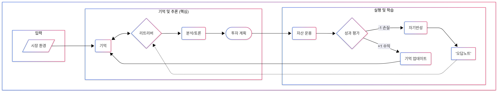
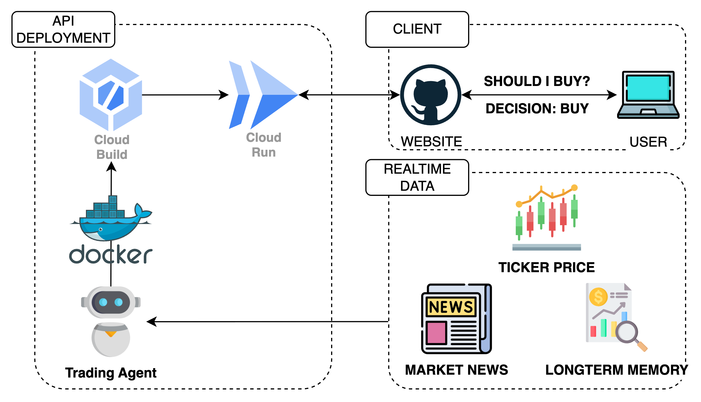

# FinMem-LLM: 자기반성 및 법률 자문이 가능한 AI 주식 트레이딩 에이전트
*Context-Aware Real-time Sentiment based AI Agent for Stock Trading*

본 프로젝트는 대규모 언어 모델(LLM)을 활용하여 실제 금융 전문가처럼 사고하고, 자신의 투자 실수를 통해 학습하며, **외부 법률 지식까지 참고하여** 의사결정을 내리는 지능형 주식 트레이딩 에이전트를 구축합니다.

이 프로젝트는 기존 FinMem의 아이디어를 바탕으로, LLM의 추론 능력을 극대화하는 새로운 아키텍처를 설계하여 완전히 새로운 차원의 의사결정 시스템을 구현했습니다.

---

## 🚀 핵심 개선점 (Key Features)

기존 FinMem 모델이 감성 분석에 의존했다면, 저희는 LLM의 추론 능력을 극대화하는 새로운 아키텍처를 설계했습니다.

### 1. 멀티-페르소나 투자 위원회 (Multi-Persona Investment Committee)
단일 관점의 분석을 탈피하여, 각기 다른 투자 철학을 가진 3개의 AI 페르소나가 독립적인 분석을 수행합니다.

-   **가치 투자자 (Value Investor)**: 재무 건전성, 부채, 현금 흐름, 내재 가치, 안전 마진 등 펀더멘털을 분석합니다.
-   **성장 투자자 (Growth Investor)**: 신제품, 시장 점유율, 혁신, 사용자 성장, 미래 촉매 등 성장 잠재력을 분석합니다.
-   **기술적 분석가 (Technical Trader)**: 주가 차트, 이동 평균, 거래량, 시장 심리, 단기 뉴스 등 모멘텀을 분석합니다.

최종적으로 **CIO(최고 투자 책임자)** 페르소나가 이들의 상충되는 의견을 종합하여, 가장 합리적인 투자 결정을 내립니다. 이 CIO는 단기적인 시장 잡음에 흔들리지 않고, 장기적인 부의 증식을 목표로 하는 확고한 투자 원칙을 따르도록 설계되었습니다.

### 2. 자기반성 학습 루프 (Self-Correction Loop)
에이전트는 단순히 거래만 하는 것이 아니라, 자신의 과거를 복기하며 학습합니다. 이 기능은 원본 FinMem의 `reflection` 모듈을 대폭 개선하여 구현되었습니다.



- **오답 노트 (Failure Memory)**: 거래에서 손실이 발생하면, "왜 실패했는가?"를 스스로 분석하여 그 원인을 '실패 기억'에 기록합니다.

- **동적 페르소나 전환**: 다음 분석 시, "오답 노트"와 현재 시장 상황(상승장/하락장)을 최우선으로 고려하여, 자신의 기본 성격(System Prompt)을 동적으로 변경합니다. 예를 들어, 하락장에서는 극도로 보수적인 리스크 관리자로 변신하여 섣부른 매수를 자제합니다.

### 3. RAG 기반 법률 자문 시스템 (RAG-based Legal Advisory)
LLM이 가진 환각(Hallucination)의 한계를 극대화하고, 실제 법률 및 규제 데이터에 기반한 의사결정을 내립니다.

- **벡터 DB 기반 지식 창고**: **법제처 국가법령정보센터**에서 제공하는 **'금융소비자 보호에 관한 법률'** 및 관련 하위 규정 데이터를 원본으로 사용하여 벡터 데이터베이스를 구축합니다.
- **사실 기반 추론**: 투자 결정 과정에서 에이전트가 이 벡터 DB에 관련 내용을 직접 질의하고, 검색된 사실을 바탕으로 법적 리스크나 규제 준수 여부를 판단합니다. 이를 통해 훨씬 더 안전하고 현실적인 트레이딩을 수행합니다.

---

## 🛠️ 시스템 아키텍처 및 사용 기술

### 배포 아키텍처
본 프로젝트는 클라우드 기반의 확장 가능한 서버리스 아키텍처로 설계되었습니다.
- **배포 흐름**: GitHub에 코드가 푸시되면, **GCP Cloud Build**가 자동으로 Docker 이미지를 빌드하고, 이 이미지를 **GCP Cloud Run**에 배포하여 트레이딩 에이전트를 실행합니다.
- **데이터 상호작용**: 실행된 에이전트는 실시간 주가(Ticker Price) 및 시장 뉴스(Market News) 데이터를 수집하고, **Faiss**로 구축된 벡터 DB 형태의 장기 기억(Long-term Memory)과 상호작용하며 분석을 수행합니다.



### 사용 기술 스택
- **Cloud**: Google Cloud Platform (GCP)
- **Programming Language**: Python
- **Containerization**: Docker
- **LLM Framework**: Langchain
- **Vector Database**: Faiss

---

## 📊 데이터셋 명세 (Dataset Specification)

시뮬레이션에는 주요 기술주에 대한 일별 주가 정보와 뉴스 기사 데이터가 포함된 데이터셋이 사용되었습니다.

| File Name  | Ticker    | Data Period (Start) | Data Period (End) | Total News Count |
| :--- | :--- | :--- | :--- | :--- |
| `aapl.pkl` | Apple     | 2021-11-15          | 2023-06-13        | 16,228           |
| `msft.pkl` | Microsoft | 2021-11-15          | 2023-06-13        | 11,601           |
| `nvda.pkl` | Nvidia    | 2021-11-15          | 2023-06-13        | 16,941           |
| `tsla.pkl` | Tesla     | 2021-11-15          | 2023-06-13        | 18,266           |

- **데이터 소스**: Stock News API
- **데이터 형식**: Pickle 파일 (`.pkl`) 내 직렬화된 Python 딕셔너리 객체
- **데이터 스키마 예시**:

  

- **감성 분석 상세**:
    - **사용 모델**: Hugging Face의 `yiyang_luo/finbert-tone`
    - **감성 분류**: Positive(긍정), Neutral(중립), Negative(부정)
    - **처리 방식**: 수집된 각 뉴스 기사에 대해 FinBERT 모델을 사용하여 감성 점수를 예측하고, "The sentiment for this news is [CLASS]." 형식의 결과 문장을 원본 텍스트에 추가하여 데이터셋을 구성합니다.

---

## 💡 구현 상세 및 프롬프트 엔지니어링

본 에이전트의 뛰어난 의사결정 능력은 인간의 사고 과정을 모방한 정교한 시스템 설계와 프롬프트 엔지니어링 기법들의 유기적인 결합을 통해 구현됩니다.

### 1. 인간의 기억을 모방한 3단계 메모리 구조
에이전트는 정보를 중요도와 시간에 따라 체계적으로 관리합니다.
-   **단기 기억 (Short-Term)**: 매일 발생하는 실시간 뉴스를 저장합니다.
-   **중기 기억 (Mid-Term)**: 분기 보고서(10-Q)와 같이 더 긴 호흡의 정보를 저장합니다.
-   **장기 기억 (Long-Term)**: 연례 보고서(10-K)처럼 기업의 장기적 펀더멘털을 담은 핵심 정보를 저장합니다.

### 2. 멀티 페르소나 위원회의 4단계 의사결정 과정
-   **1단계 (기초 분석)**: LLM이 원본 데이터를 요약하여 핵심 정보를 추출합니다.
-   **2단계 (페르소나별 심층 분석)**: 가치, 성장, 기술적 분석가 페르소나가 각자의 관점에서 심층 분석 보고서를 작성합니다.
-   **3단계 (위원회 토론)**: CIO 페르소나가 3개의 보고서를 종합하고, 가상의 Q&A를 통해 상충되는 의견을 조율합니다.
-   **4단계 (최종 계획 수립)**: CIO가 토론 결과를 바탕으로 매수, 매도, 보류 여부와 그 근거를 담은 최종 투자 계획을 수립합니다.

### 3. 적용된 프롬프트 엔지니어링 기법
-   **페르소나 패턴 (Persona Pattern)**: 각 LLM 에이전트에게 명확한 역할과 투자 철학을 부여하여 다각적 분석을 유도합니다.
-   **자기반성 (Self-Reflection)**: 과거의 실패 기록을 '오답 노트'로 만들어 다음 분석 프롬프트에 동적으로 주입하여 같은 실수를 반복하지 않도록 합니다.
-   **검색 증강 생성 (RAG)**: 법률 벡터 DB에서 관련 규정을 실시간으로 검색하고 프롬프트에 포함시켜 사실 기반의 컴플라이언스 체크를 수행합니다.
-   **구조화된 출력 (Structured Output)**: `Guardrails`와 Pydantic 모델을 활용하여 LLM의 답변을 명확한 JSON 형식으로 강제합니다.
-   **연쇄적 사고 및 토론 (Chain of Thought & Debate)**: 다단계 파이프라인을 구성하여 복잡한 문제에 대한 점진적이고 논리적인 결론을 도출합니다.

---

## 📈 투자 결과 요약 (Performance Summary)

4개의 주요 기술주(AAPL, MSFT, NVDA, TSLA)에 대한 시뮬레이션을 진행했습니다. 각 차트는 해당 기간 동안의 주가 변동 위에 에이전트의 실제 매수(▲) 및 매도(▼) 시점을 표시합니다.

|      Apple (AAPL)       |    Microsoft (MSFT)     |
| :-----------------------: | :-----------------------: |
|  |  |
|      NVIDIA (NVDA)      |       Tesla (TSLA)        |
|  |  |


전반적으로 **추세 추종 및 스윙 트레이딩 전략**을 구사하며, 특히 **뚜렷한 상승 추세에서 높은 성과**를 보이는 것으로 나타났습니다. 하지만 변동성이 크고 방향성이 불분명한 구간에서는 다소 어려움을 겪는 모습도 관찰되었습니다.

- **강점:** **NVIDIA, Apple, Microsoft**의 사례처럼 **분명한 방향성을 가진 추세 시장**에서 매우 효과적입니다.
- **약점:** **Tesla**의 사례에서 볼 수 있듯이, 뚜렷한 추세 없이 변동성이 극심한 **횡보 또는 불규칙한 장세**에서는 잦은 매매로 인한 손실이 발생할 수 있습니다.

결론적으로, 이 에이전트는 **안정적인 성장주나 기술주**에 투자할 때 높은 잠재력을 보여줄 것으로 기대됩니다.

---

## 🛠️ 시작하기 (Getting Started)

프로젝트를 실행하고 결과를 확인하는 과정은 크게 4단계로 이루어집니다.

### 1단계: 환경 설정

1.  **가상 환경 생성 및 활성화**:
    ```
    # 1. myenv.yml 파일로 가상 환경 생성
    conda env create -f myenv.yml
    
    # 2. 생성된 가상 환경 활성화
    conda activate legal_finmem

    # 3. RAG 기능에 필요한 langchain-openai 패키지 설치
    pip install langchain-openai
    ```

2.  **API 키 설정**:
    프로젝트 루트 디렉토리에 `.env` 파일을 생성하고, 그 안에 자신의 OpenAI API 키를 다음과 같이 입력합니다.
    ```
    OPENAI_API_KEY="sk-..."
    ```

### 2단계: RAG 벡터 DB 구축
1.  **문서 준비**:
    - `data/legal_documents/` 폴더에 분석을 원하는 법률 문서(.txt, .pdf 등)를 넣습니다.

2.  **DB 생성 스크립트 실행**:
    ```
    # 토크나이저 병렬 처리 비활성화 (macOS 권장)
    export TOKENIZERS_PARALLELISM=false

    # 벡터 DB 생성 스크립트 실행
    python -m puppy.build_legal_db
    ```
    > 실행이 완료되면 `vector_db` 폴더에 `legal_faiss.index`와 `legal_docs.pkl` 파일이 생성됩니다.

### 3단계: 시뮬레이션 실행

1.  **Config 파일 수정**:
    - `config/` 폴더 안의 `.toml` 파일을 열어 분석할 종목의 `trading_symbol` 등을 수정합니다.
    - `run_openai.sh` 파일 상단의 `CONFIG_FILE`, `MARKET_DATA_FILE`, `OUTPUT_PATH` 변수를 확인 및 수정합니다.

2.  **스크립트 실행**:
    ```
    # 이전 결과가 있다면 삭제하여 깨끗하게 시작 (선택 사항)
    rm -rf data/05_model_output/aapl_4o_mini_run

    # 시뮬레이션 실행
    bash run_openai.sh
    ```
    > **체크포인트**: 시뮬레이션이 중간에 중단되더라도, 동일한 명령어를 다시 실행하면 지정된 결과 저장 경로의 체크포인트를 통해 자동으로 이어서 실행됩니다.

### 4단계: 결과 확인 및 분석

1.  **리포트 생성**:
    `run_openai.sh` 스크립트가 시뮬레이션 후 자동으로 리포트를 생성합니다. 수동으로 다시 생성하려면 아래 명령어를 사용합니다.
    ```
    # 예시: AAPL 결과 리포트만 다시 생성
    python save_file.py --output-path data/05_model_output/aapl_4o_mini_run
    ```

2.  **과정 및 영향력 분석**:
   - **로그 분석**: AI 에이전트의 상세 행동 로그는 `data/04_model_output_log/`에서 확인할 수 있습니다.
   - **결과 보고서 분석**: 생성된 `[종목명]_full_report_...json` 파일을 열어 RAG의 실제 영향력(`initial_context`, `primary_reason` 항목)을 분석합니다.
   - **시각화 및 심층 분석**: `note_book.ipynb` 파일을 열어 에이전트의 일별 자산 변화, 거래 내역, 의사결정 과정 등을 상세히 추적하고 평가할 수 있습니다.

---

## 👨‍💻 TEAM 영웅호걸
본 프로젝트는 아래 4명의 팀원이 협력하여 진행했습니다.

| 이름 (Name) | 학교/전공 (Affiliation) | GitHub / Contact |
| :--- | :--- | :--- |
| **박지원** | 동국대학교 컴퓨터공학과 | [jwon4178]([https://github.com/jwon4178](https://github.com/jiwon4178/)) |
| **오영민** | 인하대학교 통계학과 | [cjmin2001.github.io](https://cjmin2001.github.io/) |
| **김강민** | 세종대학교 인공지능학과 | [withmochaa]([https://github.com/withmochaa](https://github.com/withmochaa/)) |
| **정한결** | 국민대학교 소프트웨어학과 | [LinkedIn](https://www.linkedin.com/in/hkjung1123/) |

---

## 📜 라이선스 (License)

본 프로젝트는 원본 FinMem 프로젝트의 MIT 라이선스를 따르며, 추가적인 기여자의 저작권을 포함하고 있습니다. 자세한 내용은 `LICENSE` 파일을 참고해 주십시오.
